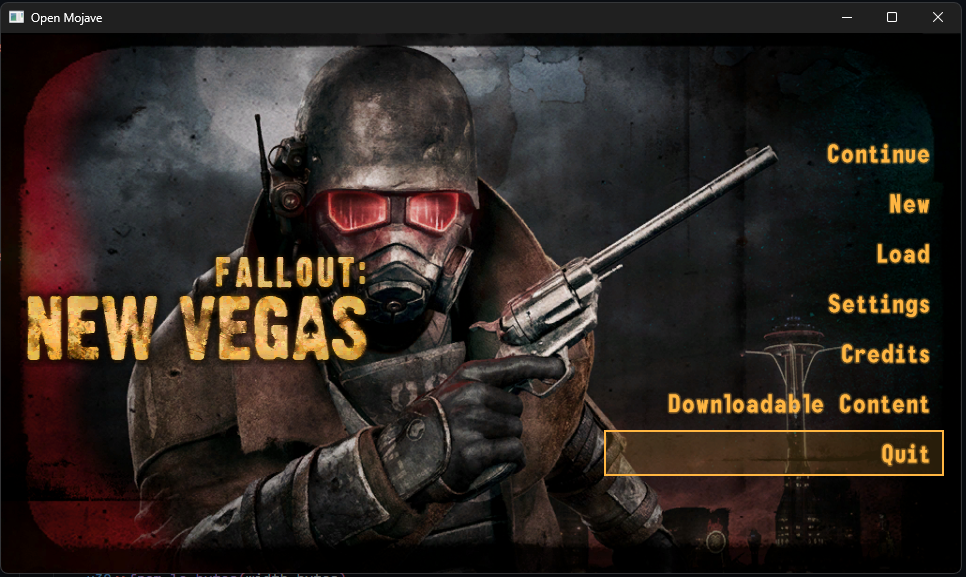

> VERY EARLY STAGES this is a hobby side project 

This is intended to be an open-source re-implementation of Fallout: New Vegas that is capable of running and using the original game assets (You'd have to get these yourself of course) 

I'm creating this in order to allow the game to take advantage of newer hardware as the game is still a 32bit game and is slowly running into issues with newer hardware as it ages.

I am writing this using *Rust* and the [Fyrox](https://github.com/FyroxEngine/Fyro) game engine, I intend for it to be a semi drop in replacement for the original game *give or take*

I've started working on getting the basic menu working which you can see below:

## Whats currently being worked on

Below is the things that im currently working on

- ESM file format parsing using https://tes5edit.github.io/fopdoc/ (33/102 records)
- Adapting and improving the engine as relevant improvements arrise from usage
 

## Whats done

- [x] Asset loading
  - .bsa packed asset format can be loaded by the engine and the resources within can be used
- [x] Font loading and rendering
  - The .fnt bitmap fonts for the game can be loaded and used in the UI
- [x] Basic parsing of .esm / .esp file format (records and group parsing, but still working on parsing individual structures)

## Whats not done

- [ ] The game